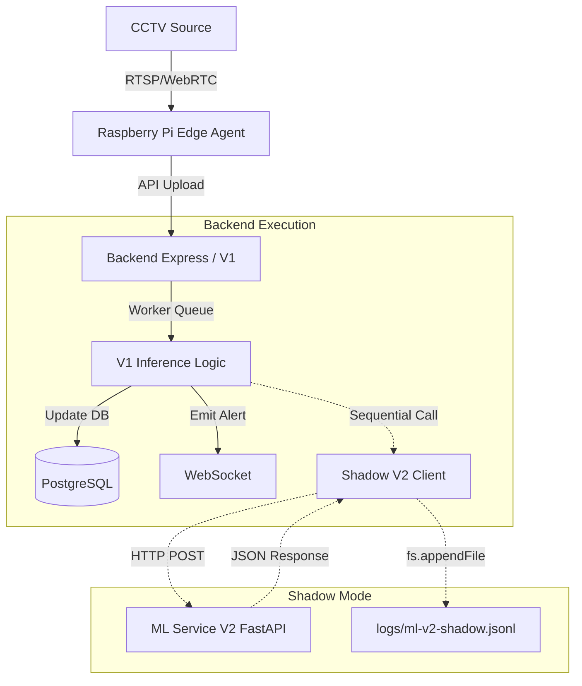

# PHASE 3A — Backend V2 Shadow Integration

This document outlines the shadow integration of ML Service V2 into the existing DISGUISE-ID backend system.

## 1. Architecture Overview



### Key Constraints enforced:
- **No changes to V1 Output**: The integration does not modify `DetectionEvent`, does not create new `Alert`s, and does not push results to the frontend.
- **Fail-Safe execution**: If the V2 API crashes, times out, or returns a 500 error, the worker will elegantly swallow the error, write a `FAILED` log, and complete the V1 job successfully.
- **No DB Mutations**: The shadow mode is completely decoupled from PostgreSQL and Prisma.

## 2. Environment Variables

To configure the shadow client, add these to `.env`:

```ini
ML_SERVICE_V2_ENABLED=true
ML_SERVICE_V2_SHADOW_MODE=true
ML_SERVICE_V2_URL=http://127.0.0.1:8001
ML_SERVICE_V2_API_KEY=YOUR_API_KEY
ML_SERVICE_V2_TIMEOUT_MS=30000
ML_SERVICE_V2_FAIL_JOB=false
ML_SERVICE_V2_SHADOW_LOG_PATH=logs/ml-v2-shadow.jsonl
```

## 3. Request Flow

1. Worker picks up an inference job (`inference.worker.ts`).
2. Frame is fetched from MinIO and processed via the V1 legacy ML pipeline.
3. V1 stores the results in the DB (creating alerts if necessary).
4. **Before finishing the job**, if `ML_SERVICE_V2_ENABLED=true`, the worker invokes `mlServiceV2Client.shadowInfer`.
5. The `shadowInfer` method builds a `multipart/form-data` payload containing the image buffer and provisional metadata (`legacy-session-*`, `legacy-job-*`).
6. An Axios HTTP POST is sent to `http://127.0.0.1:8001/v2/infer-face` using `x-api-key`.

## 4. Response Flow

1. The FastApi V2 service returns a complete JSON response detailing Dual-Branch Margin-Max logic.
2. The Node.js Client uses Zod schemas (`v2InferenceResponseSchema`) to strictly validate the payload structure.
3. The response is transformed into a flat structured JSON log object.
4. If an error occurs (timeout, 401, 500, network error), an appropriate `V2ErrorCode` is logged.
5. `mlServiceV2Logger` asynchronously appends the JSON string to `logs/ml-v2-shadow.jsonl` using a robust, non-throwing, concurrent-safe batch writer.

## 5. JSONL Format

Successful request:
```json
{"timestamp":"2026-08-04T12:00:00.000Z","jobId":"123","cameraId":"cam-1","status":"SUCCESS","latency_ms":156,"modelVersion":"stage20b-seed2026-arcface-buffalo_l","galleryVersion":"...","original_valid":true,"original_score":0.78,"original_margin":0.12,"reconstructed_valid":true,"reconstructed_score":0.82,"reconstructed_margin":0.15,"decision":"HIGH_PRIORITY_CANDIDATE","candidate_id":"DID001","selected_branch":"reconstructed","score":0.82,"margin":0.15}
```

Failed request:
```json
{"timestamp":"2026-08-04T12:00:00.000Z","jobId":"123","cameraId":"cam-1","status":"FAILED","latency_ms":30001,"errorCode":"V2_TIMEOUT","reason":"Request timed out"}
```

## 6. How to Test

### Automated Unit Tests (Offline)
Tests all error paths, invalid keys, timeouts, schema violations, and successful mapping.
```bash
npm test
```

### Manual CLI Testing (Live shadow against V2)
Make sure the V2 FastAPI is running, then use a real image.
```bash
npm run test:ml-v2-shadow -- --image path_to_real_image.jpg
```

## 7. Rollback / Troubleshooting

If the shadow mode is suspected to cause memory leaks or performance degradation, disable it immediately by changing `.env`:

```ini
ML_SERVICE_V2_ENABLED=false
```

Restart the backend:
```bash
npm run build && npm run start
```
The legacy V1 pipeline will remain 100% operational, and the V2 HTTP client will skip all calls.
