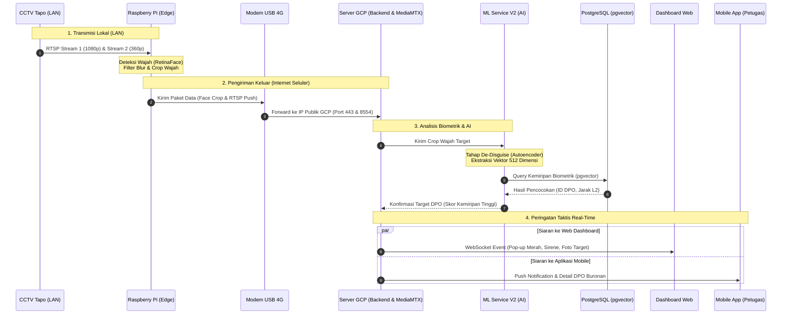

# Dokumentasi Sistem DISGUISE-ID: Arsitektur Hardware, Cloud, & Alur End-to-End

Dokumen ini menjelaskan secara komprehensif seluruh arsitektur sistem **DISGUISE-ID**, mulai dari perangkat keras (*hardware*) di lapangan (*Edge*), jalur transmisi jaringan, infrastruktur *Cloud* di Google Cloud Platform (GCP), hingga antarmuka pengguna (*Dashboard Web* & *Aplikasi Mobile*).

---

## 1. Arsitektur Perangkat Keras & Jaringan (*Hardware & Network Infrastructure*)

Sistem DISGUISE-ID membagi beban komputasi secara *hybrid* antara **Edge Processing** di lapangan dan **Cloud AI Processing** di server terpusat.

```
┌───────────────────────────────────────────────────────────────────────────────────────────────────┐
│                                LOKASI FISIK / EDGE (POS PANTAU / TKP)                              │
│                                                                                                   │
│   ┌────────────────────────┐         Kabel LAN RJ-45        ┌──────────────────────────────────┐  │
│   │    CCTV TP-Link Tapo   │ ─────────────────────────────> │       Raspberry Pi 4 / 5         │  │
│   │                        │        (Subnet Lokal:          │  (Camera Agent Native - Python)  │  │
│   │ • Stream 1 (1080p FHD) │       192.168.1.27:554)        │                                  │  │
│   │ • Stream 2 (360p Sub)  │                                │ 1. AI RetinaFace (Wajah & Box)   │  │
│   └────────────────────────┘                                │ 2. Filter Blur (Laplacian)       │  │
│                                                             │ 3. FFmpeg Push Stream (RTSP)     │  │
│                                                             └────────────────┬─────────────────┘  │
│                                                                              │ Port USB           │
│                                                                              ▼                    │
│                                                             ┌──────────────────────────────────┐  │
│                                                             │       Modem USB 4G / LTE         │  │
│                                                             │     (Cellular WAN Internet)      │  │
│                                                             └────────────────┬─────────────────┘  │
└──────────────────────────────────────────────────────────────────────────────┼────────────────────┘
                                                                               │ 
                                             Koneksi Internet Seluler (4G/LTE) │ HTTPS (API) / WSS (Socket)
                                             Menembus IP Publik 34.101.174.33  │ RTSP (Port 8554)
                                                                               ▼
┌───────────────────────────────────────────────────────────────────────────────────────────────────┐
│                                GOOGLE CLOUD PLATFORM (GCP) - SERVER PUSAT                         │
│                                                                                                   │
│  ┌─────────────────────────────────────────────────────────────────────────────────────────────┐  │
│  │                              Caddy Reverse Proxy (disguise.id)                              │  │
│  └───────┬──────────────────────────────┬──────────────────────────────┬───────────────────────┘  │
│          │                              │                              │                          │
│          ▼                              ▼                              ▼                          │
│  ┌───────────────┐              ┌───────────────┐              ┌───────────────┐                  │
│  │   MediaMTX    │              │  Backend API  │              │     MinIO     │                  │
│  │ (RTSP/WebRTC) │              │  (Node.js/TS) │              │  (S3 Storage) │                  │
│  │  Port: 8554   │              │   Port: 3000  │              │   Port: 9000  │                  │
│  └───────┬───────┘              └───────┬───────┘              └───────────────┘                  │
│          │                              │                                                         │
│          │                              ▼                                                         │
│          │                      ┌───────────────┐                                                 │
│          │                      │ ML Service V2 │ ◄── [Stage20b De-Disguise Autoencoder]          │
│          │                      │(PyTorch/CUDA) │ ◄── [ArcFace 512-D Feature Vector]              │
│          │                      └───────┬───────┘                                                 │
│          │                              │                                                         │
│          │                              ▼                                                         │
│          │                      ┌───────────────┐                                                 │
│          │                      │  PostgreSQL   │ ◄── [pgvector Cosine/L2 Biometric Search]       │
│          │                      │  16 Database  │                                                 │
│          │                      └───────────────┘                                                 │
└──────────┼──────────────────────────────┬─────────────────────────────────────────────────────────┘
           │                              │
           │ WebRTC (WHEP)                │ HTTPS REST API & WebSocket (WSS)
           │ Live Streaming               │ Real-Time DPO Alerts & Live Tracking Data
           ▼                              ▼
┌──────────────────────────────────────┐      ┌─────────────────────────────────────────────────────┐
│       DASHBOARD WEB (COMMAND CENTER) │      │            APLIKASI MOBILE (DISGUISE-MOBILE)        │
│          (Next.js 14 / TypeScript)   │      │              (Flutter - Android / iOS)              │
│                                      │      │                                                     │
│ • Live Video CCTV & AI Bounding Box  │      │ • Push Notification Instan ke Petugas Lapangan      │
│ • Peringatan DPO Real-Time (Pop-up)  │      │ • Profil Lengkap & Foto DPO Buronan                 │
│ • Manajemen DPO (Watchlist)          │      │ • Live Alert Feed & Status Tindakan Taktis          │
│ • ML V2 Model Audit & Analytics      │      │ • Kompas & Koordinat Lokasi Kamera CCTV             │
└──────────────────────────────────────┘      └─────────────────────────────────────────────────────┘
```

---

### Spesifikasi Hardware Lapangan (*Edge Node*):
1. **Kamera CCTV (TP-Link Tapo C200 / C310 / Serupa):**
   - Mengalirkan protokol RTSP lokal dengan 2 saluran (*Dual Stream*):
     - **Stream 1 (`/stream1` - 1080p FHD):** Digunakan khusus oleh model AI di Raspberry Pi untuk mendeteksi wajah dengan resolusi tinggi.
     - **Stream 2 (`/stream2` - 360p @ 15fps):** Digunakan untuk dikirim (*push*) ke server cloud agar hemat kuota internet dan lancar.
2. **Koneksi LAN (Lokal):**
   - Menghubungkan CCTV ke Raspberry Pi menggunakan kabel LAN UTP Cat5e/Cat6 melalui Switch/Router lokal tanpa membutuhkan akses internet pada kamera.
3. **Raspberry Pi (Processing Unit):**
   - Menjalankan sistem operasi Linux (Raspberry Pi OS) dan program `camera-agent-native` berbasis Python.
   - Mengambil frame dari RTSP LAN, menjalankan model deteksi wajah **RetinaFace**, menyaring frame buram (*blur rejection*), dan mengekstrak kotak koordinat wajah (*bounding box*).
4. **Modem USB 4G / LTE Dongle:**
   - Terpasang pada port USB Raspberry Pi.
   - Bertindak sebagai gerbang keluar (*Gateway WAN*) menggunakan kartu SIM seluler 4G untuk mengirim data frame wajah dan video RTSP ke Server GCP di cloud.

---

## 2. Komponen Server Cloud (Google Cloud Platform)

Server pusat berjalan di atas VM GCP Compute Engine (`34.101.174.33`) menggunakan arsitektur container Docker:

1. **Caddy Reverse Proxy:**
   - Mengelola rute domain `disguise.id`, `api.disguise.id`, `storage.disguise.id`, dan `stream.disguise.id`.
   - Mengamankan komunikasi dengan enkripsi SSL/TLS (HTTPS & WSS).
2. **MediaMTX (RTSP to WebRTC Gateway):**
   - Menerima aliran video *Push* dari Raspberry Pi via port **8554 (RTSP over TCP)**.
   - Mengonversi video menjadi format **WebRTC WHEP (Port 8889)** sehingga dapat diputar di browser web dan HP tanpa *delay* (*latency* < 0.5 detik).
3. **Backend API (Node.js & Express / TypeScript):**
   - Menerima data koordinat deteksi wajah dan foto wajah dari Raspberry Pi via API terenkripsi.
   - Memantau kondisi hidup/mati kamera (*heartbeat*).
   - Menghubungkan antrean pemrosesan biometrik ke ML Service.
   - Mengirimkan sinyal alarm seketika (*real-time WebSocket broadcast*) ke Dashboard Web dan Aplikasi Mobile.
4. **ML Service V2 (Python, PyTorch, & CUDA):**
   - **Stage20b Autoencoder (De-Disguise):** Membuka penyamaran target (menghilangkan efek masker, kacamata hitam, atau topi secara digital).
   - **ArcFace / InceptionResNet:** Mengekstrak fitur biometrik wajah menjadi **vektor 512-dimensi**.
5. **PostgreSQL 16 & pgvector:**
   - Menyimpan seluruh data buronan (*WatchlistedPerson*).
   - Melakukan pencarian kemiripan vektor biometrik menggunakan algoritma *L2 Euclidean Distance* dan *Cosine Similarity* dalam hitungan milidetik.
6. **MinIO Object Storage:**
   - Menyimpan foto asli DPO serta arsip bukti foto wajah yang tertangkap CCTV di lapangan.
7. **Redis:**
   - Menyimpan status detak jantung (*heartbeat*) kamera, antrean inferensi BullMQ, dan *caching* sesi pengguna.

---

## 3. Alur Kerja Sistem Lengkap (*End-to-End Sequence*)



---

## 4. Skenario Operasional Nyata di Lapangan

### Skenario 1: Pendaftaran DPO Baru oleh Admin Penyidik
1. Penyidik login ke **Dashboard Web** DISGUISE-ID.
2. Membuka menu **Watchlist** dan menekan tombol **Tambah DPO**.
3. Memasukkan identitas buronan (Nama, NIK, Kasus Kejahatan) dan mengunggah **1 lembar foto wajah asli DPO**.
4. Foto dikirim ke Backend, disimpan di **MinIO**, lalu diekstraksi oleh **ML Service V2** menjadi **vektor 512-dimensi**.
5. Vektor disimpan ke dalam database **PostgreSQL (pgvector)**. DPO kini aktif dan seluruh kamera di lapangan otomatis siaga memburu target.

---

### Skenario 2: Target Melintas di Lapangan (Wajah Terbuka / Normal)
1. DPO melintas di depan kamera CCTV TP-Link Tapo yang terpasang di lokasi pemantauan.
2. Kamera mengirimkan frame ke **Raspberry Pi** melalui kabel LAN.
3. **Raspberry Pi** mendeteksi wajah target, memotong foto wajah (*crop*), dan mengirimkannya ke Server GCP via **Modem USB 4G**.
4. Server GCP meneruskan wajah ke **ML Service V2**, mengekstrak vektor identitasnya, dan mencocokkannya dengan database **pgvector**.
5. Database menyatakan **COCOK** (misal skor kemiripan `92%`).
6. **Alarm Berbunyi:**
   - Di **Dashboard Web Command Center**, muncul pop-up merah dengan bunyi sirene dan lokasi kamera CCTV.
   - Di **Aplikasi Mobile Petugas Lapangan**, masuk notifikasi instan bergetar yang menampilkan foto DPO, foto tangkapan CCTV, dan estimasi lokasi untuk penyergapan cepat.

---

### Skenario 3: Target Menyamar Menggunakan Masker dan Topi
*Keunggulan utama (Novelty) sistem DISGUISE-ID.*

1. DPO melintas dengan sengaja mengenakan masker medis menutupi hidung & mulut serta topi untuk mengelabui petugas.
2. **Raspberry Pi** tetap mengenali struktur mata dan dahi sebagai wajah manusia dan mengirimkan hasil *crop* ke Cloud.
3. **Fase De-Disguise (Stage20b Autoencoder):**
   - ML Service mendeteksi adanya oklusi/penyamaran.
   - Model **Stage20b SkipConnectedAutoencoder** merekonstruksi bagian wajah yang tertutup masker berdasarkan fitur mata dan kontur dahi, menghasilkan representasi wajah utuh tanpa masker.
4. **Vektorisasi & Pencocokan Ulang:**
   - Wajah yang telah direkonstruksi diekstrak menjadi vektor 512 dimensi.
   - Database **pgvector** berhasil mencocokkan wajah rekonstruksi tersebut dengan foto asli DPO di database dengan tingkat keyakinan tinggi (misal `78%`).
5. **Alarm Terpicu:** Petugas di posko dan penyidik di lapangan langsung menerima notifikasi bahwa DPO yang menyamar telah teridentifikasi dan siap diamankan.
