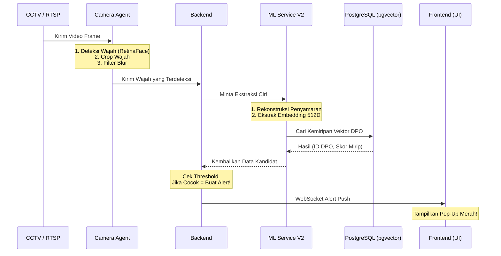

# Dokumentasi Sistem DISGUISE-ID: Arsitektur, Alur, & Skenario

Dokumen ini menjelaskan secara menyeluruh bagaimana sistem **DISGUISE-ID** beroperasi, apa saja komponen utamanya, serta menyimulasikan skenario nyata di lapangan untuk memperjelas cara kerja sistem *end-to-end*.

---

## 1. Komponen Utama Sistem

Sistem DISGUISE-ID dibangun menggunakan arsitektur *microservices* terdistribusi yang terdiri dari komponen-komponen berikut:

1. **MediaMTX (RTSP Server):** Bertindak sebagai gerbang masuk (*router*) untuk semua aliran video CCTV fisik. Server ini mengubah sinyal CCTV (RTSP) menjadi format WebRTC agar bisa ditonton langsung (secara *live* dan tanpa *delay*) melalui *browser*.
2. **Camera Agent (Python):** *Service* cerdas yang menempel pada *stream* CCTV. Bertugas untuk mengambil gambar (frame) dari video, mendeteksi wajah dengan model **RetinaFace**, dan melakukan filter kualitas (membuang gambar *blur*).
3. **Backend (Node.js/Express):** Otak orkestrasi sistem. Mengatur autentikasi, manajemen data DPO (Buronan), menghubungkan *Camera Agent* ke *ML Service*, dan menyebarkan notifikasi (*alert*) melalui WebSocket.
4. **ML Service V2 (Python/PyTorch):** Mesin Kecerdasan Buatan tingkat lanjut. Menggunakan model **Stage20b Autoencoder** untuk memulihkan wajah yang memakai penyamaran (*de-disguise*), dan **ArcFace** untuk mengekstrak vektor identitas wajah (*embedding 512-dimensi*).
5. **PostgreSQL & pgvector:** *Database* relasional yang dilengkapi ekstensi pencarian vektor. Digunakan untuk menyimpan data profil DPO beserta *vector embedding*-nya, serta melakukan pencocokan (*Cosine Similarity*) dengan super cepat.
6. **MinIO (S3-Compatible):** Tempat penyimpanan objek. Menyimpan foto profil asli DPO dan tangkapan layar (*crop* wajah) dari CCTV.
7. **Frontend (Next.js):** Antarmuka pengguna (*Dashboard*). Tempat admin Polri menambahkan data DPO, memantau *live* CCTV, dan menerima peringatan instan jika buronan tertangkap kamera.
8. **Redis:** Digunakan untuk *caching* dan menjamin kecepatan komunikasi data sementara.

---

## 2. Alur Sistem Keseluruhan (*End-to-End Flow*)

---

## 3. Skenario Penggunaan Nyata (*Real-World Scenarios*)

Untuk mempermudah pemahaman, mari kita lihat 3 skenario utama bagaimana sistem ini bereaksi dalam kondisi nyata.

### Skenario A: Mendaftarkan Buronan (DPO) Baru ke Sistem
1. **Admin Login:** Admin kepolisian *login* ke *dashboard* DISGUISE-ID.
2. **Input Data:** Admin membuka halaman "Tambah DPO Baru". Ia mengisi nama, nomor kasus, dan mengunggah **1 lembar foto asli DPO** yang paling jelas.
3. **Ekstraksi Awal:** Frontend mengirim foto tersebut ke Backend. Backend menyimpan foto itu ke **MinIO** dan mengirimkannya ke **ML Service V2**.
4. **Vektorisasi:** ML Service membedah wajah DPO tersebut menggunakan ArcFace dan menghasilkan daftar angka sepanjang 512 dimensi.
5. **Penyimpanan:** Vektor 512 dimensi tersebut disimpan di tabel `WatchlistedPerson` pada **PostgreSQL (pgvector)**. 
6. **Selesai:** DPO kini aktif dan seluruh kamera secara otomatis siap mengintai DPO tersebut.

### Skenario B: Buronan Melintas di Depan Kamera (Wajah Terbuka)
1. **Target Terpantau:** DPO melintasi stasiun kereta api di mana CCTV DISGUISE-ID terpasang.
2. **Kamera Menangkap:** **Camera Agent** memotong *frame* video, menemukan wajah DPO, dan mengirimkannya ke Backend.
3. **Pencarian Cepat:** Backend mengirimnya ke ML Service. ML Service menyadari tidak ada kacamata/masker tebal, sehingga langsung mengekstrak vektor wajahnya.
4. **Pencocokan:** Model menembakkan *query* ke **pgvector**. Karena vektor wajah tangkapan kamera **sangat identik** dengan vektor foto DPO di *database* (misal kemiripan `85%`, melewati batas *threshold* `38%`), *database* menyatakan "COCOK".
5. **Alarm Terpicu:** Backend mencatat kejadian deteksi ini, lalu menembakkan sinyal WebSocket ke *browser* admin kepolisian.
6. **Tindakan:** Sebuah *pop-up* merah dengan bunyi sirine muncul di layar admin: *"PERINGATAN: DPO atas nama X terdeteksi di Kamera Stasiun Tugu!"* beserta foto tangkapan.

### Skenario C: Buronan Melintas dengan Masker dan Topi (Penyamaran)
*Ini adalah fitur unggulan utama (Novelty) dari sistem DISGUISE-ID.*

1. **Target Menyamar:** DPO melintasi jalan raya sambil mengenakan masker medis menutupi hidung & mulut, serta topi.
2. **Kamera Menangkap:** **Camera Agent** tetap berhasil mendeteksi "ada wajah" di sana. Wajah bermasker itu dikirim ke Backend.
3. **Fase De-Disguise (Autoencoder):** Wajah bermasker masuk ke **ML Service V2**. Di sini, alih-alih langsung dihitung kemiripannya, model **Stage20b** (SkipConnectedAutoencoder) diaktifkan. Model ini "merekonstruksi" atau "menebak" struktur hidung dan mulut di balik masker berdasarkan ciri mata dan dahi, menghasilkan gambar wajah yang sudah "dibersihkan" dari penyamarannya.
4. **Vektorisasi Ulang:** Wajah hasil rekonstruksi (tanpa masker) itulah yang diekstrak menjadi 512 dimensi.
5. **Pencocokan:** Hasil vektor ini dikirim ke **pgvector**. Berkat pembersihan penyamaran, kemiripan yang tadinya mungkin cuma `20%` (karena tertutup) sekarang naik menjadi `55%` (Cocok!).
6. **Alarm Terpicu:** Seperti pada Skenario B, sistem memberi sinyal ke *dashboard*, dan petugas kepolisian dapat mencegat DPO tersebut secara langsung.
