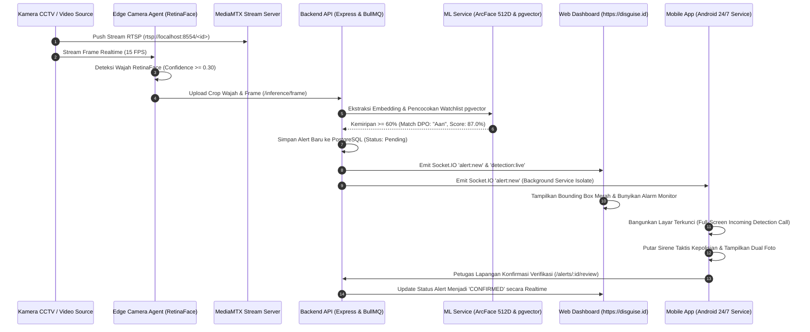

# DOKUMENTASI LENGKAP FITUR, HALAMAN, DAN BASE URL SISTEM DISGUISE-ID

**DISGUISE-ID** adalah sistem pengawasan intelijen dan pengenalan wajah buronan (*DPO - Daftar Pencarian Orang*) berbasis AI real-time yang dirancang untuk mendukung operasi taktis kepolisian dan aparat penegak hukum, baik di command center (Web Dashboard) maupun di lapangan (Mobile App).

---

## 1. Topologi Jaringan & Base URL Produksi

Sistem beroperasi di bawah domain utama **`disguise.id`** dengan reverse proxy Caddy dan SSL terintegrasi:

| Komponen / Subdomain | Production URL / Base Endpoint | Protokol | Fungsi Utama |
| :--- | :--- | :--- | :--- |
| **Domain Utama (Web Dashboard)** | **`https://disguise.id`** | HTTPS / HTTP | Portal Command Center & Web App Next.js |
| **Backend REST API** | **`https://api.disguise.id/api/v1`** | HTTPS | Endpoint Core Business Logic, Ingesti, & Sinkronisasi |
| **Realtime WebSocket Server** | **`wss://api.disguise.id`** (`/socket.io/`) | WSS / WS | Siaran realtime alert deteksi, tracking, & status kamera |
| **Live Stream Server (WHEP/WebRTC)**| **`https://stream.disguise.id`** | HTTPS / WebRTC | Streaming video CCTV latensi ultra-rendah (<500ms) |
| **Object Storage (MinIO)** | **`https://storage.disguise.id`** | HTTPS | Penyimpanan terenkripsi foto DPO, frame, & crop wajah |
| **Mobile App Base URL** | **`https://api.disguise.id/api/v1`** | HTTPS | Endpoint komunikasi aplikasi mobile Android/iOS |

### 🗄️ Konfigurasi Bucket Object Storage (MinIO)
* **`watchlist-photos`**: Menyimpan foto resmi DPO yang didaftarkan ke sistem (`/watchlist/YYYY/MM/DD/<id>.png`).
* **`cctv-frames`**: Menyimpan frame tangkapan penuh dari kamera CCTV (`/frames/YYYY/MM/DD/<id>.jpg`).
* **`faces`**: Menyimpan hasil crop wajah beresolusi tinggi hasil deteksi RetinaFace (`/faces/<id>.jpg`).
* **`audit-logs`**: Arsip log ekspor audit dan laporan investigasi forensik.

---

## 2. Dokumentasi Halaman Web Dashboard (Next.js)

Seluruh halaman Web Command Center berada di bawah domain utama **`https://disguise.id`** dengan otorisasi berbasis Role-Based Access Control (RBAC).

---

### 2.1. Landing Page (`/`)
* **URL**: `https://disguise.id/`
* **Hak Akses**: Publik
* **Fungsi**:
  * Menampilkan perkenalan sistem DISGUISE-ID dan arsitektur pengawasan cerdas.
  * Menampilkan pilar teknologi: deteksi *RetinaFace*, ekstraksi embedding 512-D *ArcFace*, *Generative Shadow Pipeline*, dan *Multi-Frame Voting*.
  * Menyediakan navigasi langsung menuju halaman login command center.

---

### 2.2. Login Page (`/login`)
* **URL**: `https://disguise.id/login`
* **Hak Akses**: Publik
* **Fungsi**:
  * Autentikasi operator command center dan administrator menggunakan email dan password.
  * Penyimpanan JWT Access Token & Refresh Token terenkripsi pada cookie/local storage.
  * Pengambilan konteks organisasi (`orgId`) pengguna untuk isolasi data multi-tenant.
* **API Backend Terkait**:
  * `POST https://api.disguise.id/api/v1/auth/login`

---

### 2.3. Executive Dashboard (`/dashboard`)
* **URL**: `https://disguise.id/dashboard`
* **Hak Akses**: Admin, Analyst, Officer, Field Operator
* **Fungsi**:
  * **Statistik KPI Utama**: Menampilkan metrik ringkasan (Total Deteksi Hari Ini, Jumlah Target DPO Aktif, Kamera CCTV Online/Offline, dan Pending Alerts yang belum ditriase).
  * **Grafik Tren Deteksi**: Visualisasi volume deteksi per jam/hari menggunakan diagram interaktif.
  * **Aktivitas Terkini (Recent Sighting Feed)**: Daftar deteksi DPO terbaru lengkap dengan nama target, kamera sumber, tingkat kemiripan (%), dan waktu deteksi.
  * **Status Kesehatan Sistem**: Status koneksi database PostgreSQL, Redis, MediaMTX, dan ML Engine.
* **API Backend Terkait**:
  * `GET https://api.disguise.id/api/v1/analytics/dashboard`
  * `GET https://api.disguise.id/api/v1/alerts?limit=5&status=pending`

---

### 2.4. Live CCTV Surveillance Grid (`/dashboard/monitor`)
* **URL**: `https://disguise.id/dashboard/monitor`
* **Hak Akses**: Admin, Analyst, Officer
* **Fungsi**:
  * **Multi-Camera Grid**: Menampilkan live streaming video CCTV multi-layar (1x1, 2x2, 3x3) via WebRTC WHEP (`https://stream.disguise.id/<camera_id>`).
  * **Live Bounding Box Overlay**: Menggambar kotak deteksi wajah di atas video secara real-time melalui event Socket.IO (`detection:live`). Kotak hijau/cyan untuk wajah biasa, dan **merah berkedip** untuk target DPO yang cocok.
  * **HUD Biometrik & Tactical Audio Alert**: Mengeluarkan suara alarm peringatan instan saat DPO terdeteksi di salah satu sudut kamera.
  * **Quick Sighting Drawer**: Panel samping yang langsung memunculkan kartu identitas DPO yang baru saja tertangkap kamera untuk inspeksi cepat.
* **API Backend Terkait**:
  * `GET https://api.disguise.id/api/v1/cameras`
  * `GET https://api.disguise.id/api/v1/cameras/:id/status`
  * WebSocket Event: `detection:live`, `alert:new`, `camera:status`

---

### 2.5. Alerts Center & Triage (`/dashboard/alerts`)
* **URL**: `https://disguise.id/dashboard/alerts`
* **Hak Akses**: Admin, Analyst, Officer
* **Fungsi**:
  * **Triage & Manajemen Deteksi**: Mengelola seluruh insiden deteksi DPO dengan status `PENDING`, `VERIFIED` (Terkonfirmasi), `FALSE_POSITIVE` (Bukan Target), dan `DISMISSED` (Diabaikan).
  * **Dual Foto Perbandingan**: Menampilkan foto asli DPO bersanding langsung dengan foto hasil crop CCTV dan rekaman frame penuh.
  * **Breakdown Skor Biometrik**: Menampilkan persentase kemiripan terkalibrasi (%), jarak Euclidean L2, tingkat keyakinan (Tinggi/Sedang), dan margin pembeda terhadap kandidat lain.
  * **Multi-Filter**: Filter berdasarkan rentang tanggal, kamera CCTV tertentu, tingkat prioritas (`critical`, `high`, `medium`), dan nama target.
  * **Assign & Review**: Menugaskan alert ke personel lapangan tertentu untuk verifikasi fisik di lokasi.
* **API Backend Terkait**:
  * `GET https://api.disguise.id/api/v1/alerts`
  * `GET https://api.disguise.id/api/v1/alerts/:id`
  * `PATCH https://api.disguise.id/api/v1/alerts/:id/status`
  * `POST https://api.disguise.id/api/v1/alerts/:id/assign`

---

### 2.6. Watchlist / Manajemen DPO (`/dashboard/watchlist`)
* **URL**: `https://disguise.id/dashboard/watchlist`
* **Hak Akses**: Admin, Analyst, Officer
* **Fungsi**:
  * **Pusat Database Buronan**: Menampilkan katalog seluruh target DPO yang diawasi oleh organisasi.
  * **Registrasi DPO Baru**: Form pendaftaran target lengkap dengan Nama Lengkap, Nomor Perkara/Kasus, Catatan Ciri Fisik, Status Bahaya (`high`, `medium`, `low`), dan status aktif.
  * **Upload Multi-Foto & Auto Embedding**: Unggah beberapa foto referensi wajah (tampak depan, samping, kacamata, topi) yang secara otomatis diekstraksi menjadi vektor embedding 512 dimensi via ArcFace dan disimpan ke pgvector.
  * **Manajemen Galeri Foto DPO**: Menghapus atau menambah foto variasi baru untuk meningkatkan akurasi pencocokan di lapangan.
* **API Backend Terkait**:
  * `GET https://api.disguise.id/api/v1/watchlist`
  * `POST https://api.disguise.id/api/v1/watchlist`
  * `GET https://api.disguise.id/api/v1/watchlist/:id`
  * `PUT / PATCH https://api.disguise.id/api/v1/watchlist/:id`
  * `POST https://api.disguise.id/api/v1/watchlist/:id/photos`
  * `DELETE https://api.disguise.id/api/v1/watchlist/:id`

---

### 2.7. Manajemen Kasus Taktis (`/dashboard/cases` & `/dashboard/cases/[id]`)
* **URL**: `https://disguise.id/dashboard/cases` dan `https://disguise.id/dashboard/cases/[id]`
* **Hak Akses**: Admin, Analyst, Officer
* **Fungsi**:
  * **Pengelompokan Kasus Operasi**: Mengelompokkan satu atau beberapa target DPO ke dalam berkas kasus operasi spesifik (misal: "Operasi Curanmor Wilayah A").
  * **Detail Kasus (`/[id]`)**: Menampilkan daftar tersangka terkait, daftar personel/petugas yang ditugaskan, ringkasan kronologi, dan log catatan penyidikan.
  * **Timeline Sighting Kasus**: Menampilkan kronologi seluruh deteksi CCTV yang relevan dengan kasus tersebut secara terurut berdasarkan waktu.
* **API Backend Terkait**:
  * `GET https://api.disguise.id/api/v1/cases`
  * `POST https://api.disguise.id/api/v1/cases`
  * `GET https://api.disguise.id/api/v1/cases/:id`
  * `PATCH https://api.disguise.id/api/v1/cases/:id`

---

### 2.8. Analytics & Heatmap (`/dashboard/analytics`)
* **URL**: `https://disguise.id/dashboard/analytics`
* **Hak Akses**: Admin, Analyst
* **Fungsi**:
  * **Distribusi Deteksi per Wilayah & Kamera**: Grafik perbandingan jumlah deteksi pada setiap titik CCTV.
  * **Heatmap Aktivitas Target**: Visualisasi intensitas kemunculan target DPO berdasarkan jam dan hari.
  * **Metrik Kinerja AI**: Evaluasi rasio konfirmasi vs false positive, rata-rata waktu respons operator, dan akurasi model.
* **API Backend Terkait**:
  * `GET https://api.disguise.id/api/v1/analytics/overview`
  * `GET https://api.disguise.id/api/v1/analytics/cameras-performance`
  * `GET https://api.disguise.id/api/v1/analytics/accuracy-metrics`

---

### 2.9. ML V2 Evaluation Platform (`/dashboard/ml-v2`)
* **URL**: `https://disguise.id/dashboard/ml-v2`
  * Sub-halaman: `/dashboard/ml-v2/reviews`, `/dashboard/ml-v2/promotions`, `/dashboard/ml-v2/reviewed-alerts`
* **Hak Akses**: Super Admin, AI Engineer, Lead Analyst
* **Fungsi**:
  * **Shadow Pipeline Monitoring**: Memantau inferensi model AI V2 (yang berjalan secara *shadow* di latar belakang tanpa mengganggu alur utama V1).
  * **Ulasan False Positive Lapangan (`/reviews`)**: Mengkaji laporan ketidakcocokan wajah dari petugas lapangan untuk dijadikan bahan evaluasi model AI.
  * **Evaluasi & Promosi Model (`/promotions`)**: Menguji metrik performa model V2 sebelum dipromosikan menggantikan model aktif.
* **API Backend Terkait**:
  * `GET https://api.disguise.id/api/v1/ml-v2/stats`
  * `GET https://api.disguise.id/api/v1/ml-v2/reviews`
  * `POST https://api.disguise.id/api/v1/ml-v2/promotions`

---

### 2.10. User & RBAC Management (`/dashboard/users`)
* **URL**: `https://disguise.id/dashboard/users`
* **Hak Akses**: Super Admin, Organization Admin
* **Fungsi**:
  * Manajemen akun pengguna: Tambah pengguna baru, ubah role (`SUPER_ADMIN`, `ADMIN`, `ANALYST`, `OFFICER`, `FIELD_OPERATOR`), reset password, atau nonaktifkan akun.
  * Pembagian hak akses menu dan izin verifikasi data.
* **API Backend Terkait**:
  * `GET https://api.disguise.id/api/v1/users`
  * `POST https://api.disguise.id/api/v1/users`
  * `PATCH https://api.disguise.id/api/v1/users/:id`
  * `DELETE https://api.disguise.id/api/v1/users/:id`

---

### 2.11. Audit Log Forensik (`/dashboard/audit`)
* **URL**: `https://disguise.id/dashboard/audit`
* **Hak Akses**: Super Admin, Security Officer
* **Fungsi**:
  * Pencatatan log aktivitas sistem yang tidak dapat diubah (*immutable audit trail*).
  * Mencatat: Siapa (User ID & Nama), Kapan (Timestamp), Dari Mana (IP Address), Apa yang dilakukan (Login, Verifikasi Alert, Tambah DPO, Hapus Kamera, Ekspor Data).
* **API Backend Terkait**:
  * `GET https://api.disguise.id/api/v1/audit`
  * `GET https://api.disguise.id/api/v1/audit/export`

---

### 2.12. Konfigurasi Sistem & CCTV (`/dashboard/settings`)
* **URL**: `https://disguise.id/dashboard/settings`
* **Hak Akses**: Admin
* **Fungsi**:
  * **Pendaftaran Kamera CCTV**: Tambah kamera baru, konfigurasi RTSP stream URL, nama lokasi, zona wilayah, lantai, serta koordinat peta (Latitude & Longitude).
  * **Pengaturan Ambang Batas AI**: Mengatur batas minimum similarity score, ukuran bounding box, dan sampling interval.
  * **Integrasi MediaMTX**: Sinkronisasi path streaming otomatis dengan server MediaMTX.
* **API Backend Terkait**:
  * `GET / POST / PATCH https://api.disguise.id/api/v1/cameras`
  * `GET / PATCH https://api.disguise.id/api/v1/settings`

---

## 3. Dokumentasi Layar Aplikasi Mobile (Flutter Field Ops)

Aplikasi mobile dirancang khusus untuk petugas di lapangan dengan kemampuan **operasi 24/7 di latar belakang**, **sirene panggilan darurat full-screen saat ponsel terkunci**, serta **sinkronisasi offline (Optimistic Outbox)** menggunakan database lokal SQLite (Drift).

---

### 3.1. LoginScreen (`/login`)
* **Navigasi**: Layar awal saat aplikasi dibuka jika token belum tersedia.
* **Fungsi**:
  * Autentikasi petugas lapangan dengan kredensial akun resmi.
  * Penyimpanan session dan token ke dalam Flutter Secure Storage.
  * Inisialisasi awal database SQLite Drift lokal untuk caching data offline.
* **API Terkait**: `POST https://api.disguise.id/api/v1/auth/login`

---

### 3.2. MainShellScreen (`/home`)
* **Navigasi**: Wadah navigasi utama dengan *Persistent Bottom Navigation Bar*.
* **Fungsi**:
  * Menyediakan 4 tab menu taktis utama: **Peta Taktis**, **Daftar Alert**, **Katalog DPO**, dan **Pengaturan**.
  * Dilengkapi *Quick Status Badge* di atas ikon Alert yang menampilkan jumlah alert pending secara real-time.

---

### 3.3. LiveMapScreen (`/map`)
* **Navigasi**: Tab 1 pada Bottom Navigation Bar.
* **Fungsi**:
  * **Peta Taktis Lapangan (OpenStreetMap / Mapbox)**: Menampilkan posisi GPS pengguna saat ini bersanding dengan titik-titik kamera CCTV di sekitarnya.
  * **Marker Kamera Interaktif**: Titik CCTV diberi kode warna status (Hijau = Normal, Merah Berkedip = Ada sighting DPO dalam 6 jam terakhir).
  * **Bottom Sheet Kamera**: Mengetuk marker kamera akan memunculkan informasi nama kamera, lokasi, riwayat deteksi terakhir, dan tombol pintas untuk membuka live stream.
* **API Terkait**:
  * `GET https://api.disguise.id/api/v1/mobile/alerts/map`
  * `GET https://api.disguise.id/api/v1/cameras`

---

### 3.4. LiveCameraStreamScreen (`/cameras/live/:id`)
* **Navigasi**: Dibuka dari bottom sheet marker kamera pada peta atau daftar kamera.
* **Fungsi**:
  * **Live Stream Player CCTV**: Memutar video stream langsung dari kamera CCTV lapangan via HLS (`https://stream.disguise.id/<camera_id>/index.m3u8`) atau WebRTC.
  * Dilengkapi kontrol putar/jeda, tombol layar penuh (orientasi landscape), dan indikator latensi real-time.
* **API Terkait**: `GET https://api.disguise.id/api/v1/cameras/:id`

---

### 3.5. PersonTrailMapScreen (`/map/trail/:personId`)
* **Navigasi**: Dibuka dari halaman detail DPO atau detail alert.
* **Fungsi**:
  * **Peta Pelacakan Jalur Pergerakan (*Movement Trail*)**: Menggambar garis rute pelarian/pergerakan DPO dengan menghubungkan titik-titik koordinat kamera CCTV tempat target terdeteksi secara kronologis.
  * Menampilkan urutan nomor deteksi (1, 2, 3...) beserta waktu sighting pada setiap kamera.
* **API Terkait**: `GET https://api.disguise.id/api/v1/alerts?person_id=:personId&limit=50`

---

### 3.6. AlertsScreen (`/alerts`)
* **Navigasi**: Tab 2 pada Bottom Navigation Bar.
* **Fungsi**:
  * **Feed Alert Real-time**: Menampilkan daftar insiden deteksi DPO dengan status `pending`, `confirmed`, atau `rejected`.
  * **Reaktivitas Drift Database**: Daftar alert langsung ter-update secara instan saat ada event WebSocket `alert:new` tanpa perlu refresh manual.
  * **Filter Cepat**: Filter berdasarkan tingkat keparahan (*Critical*, *High*, *Medium*) dan status triase.
* **API & Sinkronisasi**:
  * Stream langsung dari tabel lokal SQLite Drift (`SELECT * FROM alerts ORDER BY created_at DESC`).
  * `GET https://api.disguise.id/api/v1/mobile/alerts` (Sinkronisasi latar belakang).

---

### 3.7. AlertDetailScreen (`/alerts/detail/:id`)
* **Navigasi**: Dibuka saat item pada daftar alert diklik atau saat panggilan darurat diterima.
* **Fungsi**:
  * **Dual Foto Perbandingan**: Menampilkan foto asli DPO (kiri) bersanding dengan foto crop wajah CCTV (kanan) beserta tombol zoom layar penuh.
  * **HUD Skor Kemiripan**: Visualisasi persentase kemiripan terkalibrasi (misal: `87.0%`), badge kategori keyakinan (*Tinggi/Sedang*), dan jarak biometrik.
  * **Metadata Lokasi**: Menampilkan nama kamera, nama ruangan/zona, lantai, dan koordinat.
  * **Tombol Verifikasi Lapangan**:
    * **Konfirmasi Target (Verified)**: Menyatakan bahwa target di lapangan benar adalah DPO.
    * **Bukan Target (False Positive Modal)**: Membuka dialog pilihan alasan (wajah berbeda, buram, pencahayaan, atau catatan bebas).
  * **Optimistic Outbox Service**: Jika perangkat sedang offline/kehilangan sinyal, aksi verifikasi tetap tersimpan di SQLite lokal dan otomatis dikirimkan ke backend begitu sinyal kembali.
* **API Terkait**:
  * `GET https://api.disguise.id/api/v1/alerts/:id`
  * `POST https://api.disguise.id/api/v1/alerts/:id/review`

---

### 3.8. IncomingDetectionScreen (`/alerts/incoming/:id`)
* **Navigasi & Pemicu**: **Deep Link Taktis** (`disguiseid://alerts/incoming/<alert_id>`) yang dipicu secara otomatis oleh Android Foreground Service saat target DPO terdeteksi.
* **Fungsi**:
  * **Panggilan Darurat Full-Screen (*Emergency Call HUD*)**: Tampil otomatis di layar depan bahkan ketika ponsel dalam keadaan terkunci (*Lockscreen Wake*).
  * **Pulsing Red Radial Glow & Audio Alarm**: Memancarkan animasi lingkar radar merah dan membunyikan sirene alarm kepolisian berfrekuensi tinggi.
  * **Biometric Glance Card**: Menampilkan perbandingan cepat foto DPO vs CCTV, nama buronan, skor match, dan kamera sumber.
  * **Tombol Mute Sirene**: Menonaktifkan bunyi alarm audio tanpa menutup layar.
  * **Tombol Buka Detail / Terima**: Menghentikan alarm dan langsung mengarahkan petugas ke `AlertDetailScreen` untuk penanganan taktis.
* **Komponen Terkait**:
  * `BackgroundServiceManager` (Isolate latar belakang Socket.IO).
  * `LocalNotificationService` (`fullScreenIntent: true`, `priority: Priority.max`).
  * `AudioAlertService` (Player audio sirene taktis loop).

---

### 3.9. WatchlistScreen & WatchlistDetailScreen (`/watchlist`)
* **Navigasi**: Tab 3 pada Bottom Navigation Bar.
* **Fungsi**:
  * **Pencarian Cepat DPO Mobile**: Mencari target DPO berdasarkan nama atau nomor perkara langsung dari genggaman.
  * **Detail Profil DPO**: Menampilkan seluruh galeri foto referensi, tingkat bahaya, deskripsi ciri khusus, serta tombol pintas untuk melihat riwayat kemunculan DPO di CCTV (*Person Movement Trail*).
* **API Terkait**:
  * `GET https://api.disguise.id/api/v1/watchlist`
  * `GET https://api.disguise.id/api/v1/watchlist/:id`

---

### 3.10. SettingsScreen (`/settings`)
* **Navigasi**: Tab 4 pada Bottom Navigation Bar.
* **Fungsi**:
  * **Konfigurasi Host Server**: Memilih mode host (`Production: https://api.disguise.id` atau `Development IP`).
  * **Kontrol Background Service 24/7**: Mengaktifkan atau menonaktifkan foreground service notifikasi saat aplikasi ditutup.
  * **Pengaturan Sirene Audio**: Menguji suara alarm dan mengatur volume notifikasi darurat.
  * **Status Antrean Outbox**: Memantau jumlah aksi verifikasi lokal yang sedang menunggu pengiriman ke server saat offline.
  * **Logout & Bersihkan Cache**: Keluar dari akun dan membersihkan cache token lokal.

---

## 4. Katalog Modul Backend & API Endpoints (`https://api.disguise.id/api/v1`)

Seluruh endpoint backend dilayani melalui Express.js dan terproteksi middleware otentikasi JWT / API Key.

### 4.1. Modul Autentikasi (`/auth`)
* `POST /auth/login` — Login pengguna dan penerbitan JWT Access + Refresh token.
* `POST /auth/refresh` — Pembaruan Access Token yang telah kedaluwarsa.
* `POST /auth/logout` — Pencabutan sesi dan token pengguna.
* `GET /auth/me` — Pengambilan profil dan hak akses pengguna aktif.

### 4.2. Modul Alert & Triase (`/alerts` & `/mobile/alerts`)
* `GET /alerts` — Mengambil daftar alert deteksi dengan pagination dan filter organisasi.
* `GET /alerts/:id` — Detail lengkap satu alert termasuk metadata frame dan relasi DPO.
* `PATCH /alerts/:id/status` — Memperbarui status triase alert (`confirmed`, `false_positive`, `dismissed`).
* `POST /alerts/:id/assign` — Menugaskan penanganan alert ke petugas tertentu.
* `GET /mobile/alerts` — Endpoint ringan khusus mobile yang mengembalikan format terstandarisasi.
* `GET /mobile/alerts/map` — Mengambil alert 6 jam terakhir yang memiliki koordinat geospasial untuk ditampilkan pada Peta Taktis.

### 4.3. Modul Watchlist / DPO (`/watchlist`)
* `GET /watchlist` — Mengambil daftar seluruh target DPO aktif organisasi.
* `POST /watchlist` — Mendaftarkan target DPO baru (Nama, Nomor Kasus, Tingkat Bahaya).
* `GET /watchlist/:id` — Mengambil profil detail DPO beserta seluruh galeri foto.
* `PATCH /watchlist/:id` — Memperbarui informasi profil DPO.
* `DELETE /watchlist/:id` — Menghapus/menonaktifkan DPO dari daftar pencarian.
* `POST /watchlist/:id/photos` — Mengunggah foto wajah baru DPO (Otomatis diekstraksi ke embedding 512D ArcFace).
* `DELETE /watchlist/:id/photos/:photoId` — Menghapus salah satu foto referensi DPO.

### 4.4. Modul Kamera CCTV (`/cameras`)
* `GET /cameras` — Mengambil daftar seluruh kamera CCTV organisasi beserta status online/offline.
* `POST /cameras` — Mendaftarkan kamera baru dan otomatis meregistrasikan path RTSP ke MediaMTX.
* `GET /cameras/:id` — Mengambil konfigurasi detail kamera dan URL streaming HLS/WebRTC.
* `PATCH /cameras/:id` — Memperbarui konfigurasi kamera (Nama, Koordinat Peta, RTSP URL).
* `DELETE /cameras/:id` — Menghapus kamera dan menutup streaming path di MediaMTX.

### 4.5. Modul Camera Agent & Ingesti Edge (`/camera-agent` & `/inference`)
* `GET /camera-agent/config` — Diambil oleh Edge Agent untuk sinkronisasi parameter deteksi (det_size, min_confidence).
* `POST /camera-agent/heartbeat` — Laporan berkala status hidup dan FPS kamera edge.
* `POST /camera-agent/tracking` — Mengirim koordinat bounding box real-time untuk diteruskan via WebSocket ke Web Monitor.
* `POST /camera-agent/trigger-alert` — Endpoint simulasi & injeksi alert darurat untuk pengujian taktis.
* `POST /inference/frame` — Mengunggah crop wajah dan frame scene CCTV dari Edge Agent ke antrean inferensi BullMQ.

### 4.6. Modul Machine Learning V2 (`/ml-v2`)
* `GET /ml-v2/stats` — Metrik perbandingan performa model V1 aktif vs model V2 shadow.
* `GET /ml-v2/reviews` — Daftar ulasan kasus false positive yang dilaporkan oleh petugas lapangan.
* `POST /ml-v2/promotions` — Memicu promosi model AI V2 menjadi model produksi utama.

### 4.7. Modul Kasus, Analytics, Users, & Audit
* `GET / POST / PATCH /cases` — Manajemen berkas kasus operasional taktis.
* `GET /analytics/dashboard` — Metrik ringkasan eksekutif untuk grafik dan KPI.
* `GET / POST / PATCH / DELETE /users` — Manajemen akun pengguna dan pembagian role RBAC.
* `GET /audit` — Riwayat log audit aktivitas forensik.
* `GET /system/health` — Status kesehatan container dan dependensi sistem.

### 4.8. Event Realtime WebSocket (Socket.IO)
* **`alert:new`**: Dipancarkan ke room `org:<orgId>` saat AI mendeteksi DPO dengan skor di atas threshold. Memicu bunyi alarm web dan notifikasi darurat mobile.
* **`alert:updated`**: Dipancarkan saat status alert diverifikasi atau diubah oleh salah satu operator.
* **`camera:status`**: Memperbarui status konektivitas CCTV (Online/Offline/Reconnecting).
* **`detection:live`**: Mengirimkan koordinat bounding box wajah untuk digambar di atas live video web monitor.

---

## 5. Ringkasan Alur Operasi Deteksi End-to-End



---

## 6. Lampiran: 6 Blok Kode Paling Kritis & Signifikan dalam Proyek DISGUISE-ID

Berikut adalah 6 potongan kode (*code blocks*) paling penting dan esensial dari keseluruhan arsitektur proyek **DISGUISE-ID**, mencakup AI inferensi, edge streaming, backend matching, dan mobilitas taktis lapangan.

---

### 6.1. Blok 1: Mesin Pencocokan Biometrik Vektor & Margin-Max Decision Policy
* **File Sumber**: [`disguise-backend/src/queues/inference.worker.ts`](file:///home/ichwal/disguise-id-fix/disguise-backend/src/queues/inference.worker.ts)
* **Mengapa Paling Penting**: Ini adalah **jantung pengambilan keputusan sistem (*the brain*)**. Menggunakan operator jarak Euclidean `<->` ekstensi `pgvector` di PostgreSQL untuk membandingkan embedding wajah hasil kamera dengan seluruh database DPO. Menerapkan algoritma **Margin-Max Decision Policy** (memilih antara embedding asli vs hasil rekonstruksi VAE jika terdapat oklusi/masker/kacamata) serta mengimplementasikan penyesuaian tier dinamis untuk mencegah ambiguitas identitas.

```typescript
// 1. Eksekusi Pencarian Kesamaan Vektor 512-Dimensi via pgvector (L2 Distance Operator <->)
const queryEmbedding = async (emb: number[] | null) => {
  if (!emb) return null;
  const embeddingStr = `[${emb.join(',')}]`;
  const candidates = await prisma.$queryRawUnsafe<Array<{
    id: string;
    full_name: string;
    danger_level: string;
    photo_url: string | null;
    distance: number;
  }>>(
    `SELECT
      id, full_name, danger_level, photo_url,
      (embedding <-> $1::vector) AS distance
    FROM watchlist_persons
    WHERE
      organization_id = $2
      AND is_active = true
      AND deleted_at IS NULL
      AND embedding IS NOT NULL
      AND (embedding <-> $1::vector) <= 2.0
    ORDER BY embedding <-> $1::vector
    LIMIT 3`,
    embeddingStr,
    orgId
  );

  if (candidates.length === 0) return null;

  const dist1 = Number(candidates[0].distance);
  let margin = 100.0;
  if (candidates.length > 1) {
    const dist2 = Number(candidates[1].distance);
    if (dist2 > 0) margin = ((dist2 - dist1) / dist2) * 100;
  }

  return { candidates, dist1, margin };
};

// 2. Margin-Max Decision Policy: Evaluasi Cabang Asli vs Cabang Rekonstruksi Wajah
const origResult = await queryEmbedding(v1Outcome.originalEmbedding);
const reconResult = await queryEmbedding(v1Outcome.reconstructedEmbedding);

let selectedResult = origResult;
let branchName = 'ORIGINAL';

if (reconResult && (!origResult || reconResult.margin > origResult.margin)) {
  selectedResult = reconResult;
  branchName = 'RECONSTRUCTED';
}

if (selectedResult) {
  const { candidates, dist1, margin } = selectedResult;
  bestMatchId = candidates[0].id;
  bestMatchSim = -dist1;
  marginPct = margin;

  // Klasifikasi Tier Berdasarkan Jarak Terkalibrasi ArcFace
  if (dist1 <= 1.15) {
    tier = 'TINGGI'; // Match >= 75%
  } else if (dist1 <= 1.30) {
    tier = 'SEDANG'; // Match >= 55% - 60% (Langsung diambil dan memicu alert)
  } else {
    tier = 'RENDAH';
  }

  // Analisis Margin Relatif: Jika margin < 15% (ada 2 kandidat mirip), turunkan tier agar tidak salah tangkap
  if (marginPct < 15.0) {
    if (tier === 'TINGGI') tier = 'SEDANG';
    else if (tier === 'SEDANG') tier = 'RENDAH';
  }

  if (tier === 'TINGGI' || tier === 'SEDANG') {
    isMatch = true;
  }
}
```

---

### 6.2. Blok 2: Algoritma Kalibrasi Skor Biometrik CCTV Surveillance
* **File Sumber**: [`disguise-backend/src/utils/biometric.ts`](file:///home/ichwal/disguise-id-fix/disguise-backend/src/utils/biometric.ts)
* **Mengapa Paling Penting**: Di dunia nyata, kamera CCTV menghadapi kompresi video, variasi pencahayaan, dan sudut kemiringan tajam, sehingga jarak L2 ArcFace jarang bernilai `0.0`. Fungsi matematika non-linear ini memetakan jarak Euclidean fisik menjadi persentase skor yang **intuitif bagi aparat lapangan dan memiliki nilai pembuktian forensik yang valid**.

```typescript
/**
 * Calibrated Biometric Score Mapping untuk CCTV Surveillance (ArcFace / InsightFace)
 * 
 * Pemetaan Jarak Euclidean L2 ke Persentase Match:
 * - d <= 0.70  -> 92.0% - 99.0% (Identitas Positif / Kualitas Studio Pasfoto)
 * - d = 0.88   -> 86.0% (Match CCTV Sangat Tinggi)
 * - d = 1.00   -> 82.0% (Match CCTV Tinggi)
 * - d = 1.15   -> 75.0% (Ambang Batas Match Positif CCTV)
 * - d = 1.30   -> 60.0% (Ambang Batas Deteksi Lapangan untuk Investigasi)
 * - d >= 1.40  -> < 45.0% (Bukan Target / Orang Berbeda)
 */
export function calculateCalibratedPercentage(distance: number): number {
  if (distance <= 0.70) {
    return Math.min(99.0, Math.max(92.0, 99.0 - (distance / 0.70) * 7.0));
  } else if (distance <= 1.12) {
    return 92.0 - ((distance - 0.70) / (1.12 - 0.70)) * 14.0;
  } else if (distance <= 1.30) {
    return 78.0 - ((distance - 1.12) / (1.30 - 1.12)) * 23.0;
  } else {
    return Math.max(0.0, 55.0 - ((distance - 1.30) / 0.70) * 55.0);
  }
}
```

---

### 6.3. Blok 3: Edge AI Deteksi Wajah RetinaFace & Filter Kualitas Gambar (FIQA)
* **File Sumber**: [`camera-agent/face_detector.py`](file:///home/ichwal/disguise-id-fix/camera-agent/face_detector.py)
* **Mengapa Paling Penting**: Beroperasi langsung pada node kamera (*Edge IoT*). Menggunakan modul deteksi ringan RetinaFace (`buffalo_s`), menerapkan *padding* 30% di sekitar wajah untuk menyertakan fitur rambut dan kontur dagu, serta menerapkan filter keburaman (*Face Image Quality Assessment*) berbasis varians Laplacian OpenCV agar frame yang kabur tidak membuang bandwidth server.

```python
class FaceDetector:
    """
    Ultra-lightweight Edge Face Detector.
    Strictly performs RetinaFace face detection and frame cropping on Edge.
    """
    PAD_RATIO = 0.3
    MIN_FACE_SIZE = 25

    def __init__(self, det_size=(640, 640), min_confidence=0.30):
        # Inisialisasi HANYA modul deteksi (tanpa memuat model rekognisi berat di edge)
        self.app = FaceAnalysis(
            name='buffalo_s',
            allowed_modules=['detection'],
            root='~/.insightface',
            providers=['CUDAExecutionProvider', 'CPUExecutionProvider']
        )
        self.app.prepare(ctx_id=-1, det_size=det_size)
        self.min_confidence = min_confidence

    def process_frame(self, frame: np.ndarray) -> Tuple[List[DetectedFace], bytes, FrameDimensions]:
        h, w = frame.shape[:2]
        dims = FrameDimensions(w=w, h=h)

        # Downscale frame untuk deteksi ultra-cepat real-time
        det_scale = min(640.0 / max(w, h), 1.0)
        det_frame = cv2.resize(frame, (int(w * det_scale), int(h * det_scale))) if det_scale < 1.0 else frame

        faces = self.app.get(det_frame)
        detected_faces = []

        for face in faces:
            if face.det_score < self.min_confidence:
                continue

            # Rescale koordinat bounding box ke resolusi asli
            box = (face.bbox / det_scale).astype(int)
            x1, y1, x2, y2 = box[0], box[1], box[2], box[3]

            # Berikan padding 30% agar fitur wajah utuh (rambut, dagu, kacamata)
            pad_x = int((x2 - x1) * self.PAD_RATIO)
            pad_y = int((y2 - y1) * self.PAD_RATIO)
            x1, y1 = max(0, x1 - pad_x), max(0, y1 - pad_y)
            x2, y2 = min(w, x2 + pad_x), min(h, y2 + pad_y)

            crop = frame[y1:y2, x1:x2]
            
            # FIQA: Filter Keburaman (Blur Detection) menggunakan Varians Laplacian
            gray_crop = cv2.cvtColor(crop, cv2.COLOR_BGR2GRAY)
            variance = cv2.Laplacian(gray_crop, cv2.CV_64F).var()
            if variance < config.blur_threshold:
                continue  # Buang frame kabur
                
            _, crop_encoded = cv2.imencode('.jpg', crop, [cv2.IMWRITE_JPEG_QUALITY, 95])
            detected_faces.append(DetectedFace(
                confidence=float(face.det_score),
                bbox=BBox(x=x1, y=y1, w=x2 - x1, h=y2 - y1),
                face_crop_bytes=crop_encoded.tobytes(),
            ))

        return detected_faces, thumb_bytes, dims
```

---

### 6.4. Blok 4: Android 24/7 Background Service & Sirene Lockscreen Emergency Call
* **File Sumber**: [`disguise-mobile/lib/core/realtime/background_service.dart`](file:///home/ichwal/disguise-id-fix/disguise-mobile/lib/core/realtime/background_service.dart)
* **Mengapa Paling Penting**: Memecahkan masalah krusial di Android di mana aplikasi ditutup oleh sistem operasi (*battery optimization*). Menjalankan Isolate khusus di latar belakang yang menjaga koneksi Socket.IO 24/7, dan saat alert DPO masuk, langsung mengaktifkan `fullScreenIntent` untuk **membangunkan layar ponsel yang terkunci (*Lockscreen Wake*)** dan membunyikan alarm panggilan darurat.

```dart
@pragma('vm:entry-point')
void startCallback() {
  FlutterForegroundTask.setTaskHandler(DisguiseBackgroundTaskHandler());
}

class DisguiseBackgroundTaskHandler extends TaskHandler {
  io.Socket? _backgroundSocket;
  final FlutterLocalNotificationsPlugin _localNotifications = FlutterLocalNotificationsPlugin();

  @override
  Future<void> onStart(DateTime timestamp, SendPort? sendPort) async {
    final storage = SecureStorageService();
    final token = await storage.getAccessToken();
    if (token == null || token.isEmpty) return;

    // Koneksi Socket.IO di dalam Background Isolate independen
    _backgroundSocket = io.io(
      Env.socketUrl,
      io.OptionBuilder()
          .setPath('/socket')
          .setTransports(['websocket', 'polling'])
          .enableAutoConnect()
          .enableReconnection()
          .setAuth({'token': token})
          .build(),
    );

    // Tangkap event deteksi buronan saat aplikasi tertutup
    _backgroundSocket?.on('alert:new', (data) async {
      if (data is Map) {
        final alertMap = Map<String, dynamic>.from(data);
        final alertId = alertMap['id']?.toString() ?? alertMap['alert']?['id']?.toString();
        final person = alertMap['person'] as Map? ?? {};
        final personName = person['full_name'] ?? person['fullName'] ?? 'DPO TARGET';

        // Konfigurasi Notifikasi Darurat Panggilan Penuh (Full-Screen Intent Alarm)
        final androidDetails = AndroidNotificationDetails(
          'disguise_alerts_critical',
          'Peringatan Kritis DPO',
          importance: Importance.max,
          priority: Priority.max,
          fullScreenIntent: true,         // <-- MEMBANGUNKAN LAYAR HP TERKUNCI
          visibility: NotificationVisibility.public,
          category: AndroidNotificationCategory.alarm,
          audioAttributesUsage: AudioAttributesUsage.alarm,
        );

        await _localNotifications.show(
          alertId.hashCode,
          '⚠️ TARGET DPO TERDETEKSI: $personName',
          'Ketuk untuk membuka radar visual & detail lokasi CCTV.',
          NotificationDetails(android: androidDetails),
          payload: 'disguiseid://alerts/incoming/$alertId',
        );
      }
    });
  }
}
```

---

### 6.5. Blok 5: Mekanisme Sinkronisasi Offline Taktis (Optimistic Outbox Pattern)
* **File Sumber**: [`disguise-mobile/lib/core/sync/outbox_service.dart`](file:///home/ichwal/disguise-id-fix/disguise-mobile/lib/core/sync/outbox_service.dart)
* **Mengapa Paling Penting**: Petugas kepolisian sering melakukan pengejaran di basement atau area tanpa sinyal seluler (*blindspot*). Blok kode ini memastikan keputusan verifikasi petugas langsung direspon seketika pada antarmuka (*Zero Latency Optimistic UI*), disimpan dalam antrean persisten SQLite Drift lokal, dan secara otomatis disinkronkan ke backend saat koneksi internet kembali pulih.

```dart
class OutboxService {
  final AppDatabase _db;
  final DioClient _dioClient;
  bool _isSyncing = false;

  /// Eksekusi Verifikasi Alert (Konfirmasi, False Positive, Dismiss) dengan Optimistic Update
  Future<void> submitVerificationAction({
    required String alertId,
    required String action, // 'confirm', 'reject', 'dismiss'
    String? reason,
    required String operatorFullName,
  }) async {
    final statusMap = {
      'confirm': 'confirmed',
      'reject': 'false_positive',
      'dismiss': 'dismissed',
    };
    final targetStatus = statusMap[action] ?? 'confirmed';

    // 1. Perbarui UI SQLite lokal secara instan (Optimistic Response)
    await _db.updateAlertStatus(
      alertId,
      targetStatus,
      handledBy: operatorFullName,
      handledAt: DateTime.now(),
    );

    // 2. Simpan aksi ke dalam tabel antrean Outbox persisten (Tahan restart HP)
    await _db.insertOutboxAction(
      OutboxTableCompanion(
        alertId: drift.Value(alertId),
        actionType: drift.Value(action),
        reason: reason != null ? drift.Value(reason) : const drift.Value.absent(),
        payloadJson: drift.Value(jsonEncode({
          'status': targetStatus,
          'handled_via': 'mobile',
          'reason': reason,
        })),
      ),
    );

    // 3. Picu sinkronisasi ke server di latar belakang
    unawaited(syncOutbox());
  }

  /// Mengosongkan antrean outbox ke backend dengan penanganan konflik HTTP 409
  Future<void> syncOutbox() async {
    if (_isSyncing) return;
    _isSyncing = true;
    try {
      final pendingActions = await _db.getPendingOutboxActions();
      for (final action in pendingActions) {
        final res = await _dioClient.dio.patch(
          '${ApiEndpoints.alerts}/${action.alertId}/status',
          data: jsonDecode(action.payloadJson),
        );
        if (res.statusCode == 200) {
          await _db.deleteOutboxAction(action.id); // Berhasil terkirim
        }
      }
    } catch (e) {
      // Jika offline, antrean tetap tersimpan aman di SQLite
    } finally {
      _isSyncing = false;
    }
  }
}
```

---

### 6.6. Blok 6: Live WebRTC Streaming & Dynamic Canvas Bounding Box Overlay
* **File Sumber**: [`disguise-frontend/components/LiveCamera.tsx`](file:///home/ichwal/disguise-id-fix/disguise-frontend/components/LiveCamera.tsx)
* **Mengapa Paling Penting**: Komponen visual utama pada monitor Command Center. Membuka koneksi WebRTC WHEP peer-to-peer ke server MediaMTX (`https://stream.disguise.id`) untuk latensi video di bawah 500 milidetik, lalu menggambar layer Bounding Box AI secara real-time yang tersinkronisasi dengan event WebSocket deteksi wajah.

```tsx
export const LiveCamera = ({ cameraId, cameraName, onSighting }: LiveCameraProps) => {
  const videoRef = useRef<HTMLVideoElement>(null);
  const [boxes, setBoxes] = useState<LiveDetectionBox[]>([]);

  useEffect(() => {
    // 1. Inisialisasi WebRTC WHEP (WebRTC HTTP Egress Protocol) untuk Video Latensi Rendah
    const pc = new RTCPeerConnection({
      iceServers: [{ urls: 'stun:stun.l.google.com:19302' }],
    });

    pc.ontrack = (event) => {
      if (videoRef.current && event.streams[0]) {
        videoRef.current.srcObject = event.streams[0];
      }
    };

    const startWhepStream = async () => {
      pc.addTransceiver('video', { direction: 'recvonly' });
      const offer = await pc.createOffer();
      await pc.setLocalDescription(offer);

      const whepUrl = `https://stream.disguise.id/${cameraId}/whep`;
      const res = await fetch(whepUrl, {
        method: 'POST',
        headers: { 'Content-Type': 'application/sdp' },
        body: offer.sdp,
      });
      const answerSdp = await res.text();
      await pc.setRemoteDescription({ type: 'answer', sdp: answerSdp });
    };

    startWhepStream();

    // 2. Dengarkan Bounding Box AI Real-time dari Socket.IO
    const socket = getSocket();
    socket.on('detection:live', (data: LiveTrackingPayload) => {
      if (data.cameraId === cameraId) {
        setBoxes(data.bboxes); // Update posisi kotak deteksi secara real-time
      }
    });

    return () => {
      pc.close();
    };
  }, [cameraId]);

  return (
    <div className="relative w-full h-full bg-slate-950 overflow-hidden rounded-lg">
      <video ref={videoRef} autoPlay playsInline muted className="w-full h-full object-cover" />

      {/* Layer Overlay SVG Bounding Box AI */}
      <svg className="absolute inset-0 w-full h-full pointer-events-none">
        {boxes.map((box, idx) => (
          <g key={idx}>
            <rect
              x={`${(box.x / 1920) * 100}%`}
              y={`${(box.y / 1080) * 100}%`}
              width={`${(box.w / 1920) * 100}%`}
              height={`${(box.h / 1080) * 100}%`}
              fill="none"
              stroke={box.is_match ? '#EF4444' : '#06B6D4'}
              strokeWidth="2.5"
              className={box.is_match ? 'animate-pulse' : ''}
            />
            {box.is_match && (
              <text
                x={`${(box.x / 1920) * 100}%`}
                y={`${((box.y - 8) / 1080) * 100}%`}
                fill="#EF4444"
                fontSize="12"
                fontWeight="bold"
              >
                ⚠️ {box.person_name} ({(box.similarity * 100).toFixed(1)}%)
              </text>
            )}
          </g>
        ))}
      </svg>
    </div>
  );
};
```

---

*Dokumen ini disusun sebagai panduan arsitektur resmi sistem DISGUISE-ID untuk tim pengembangan, operasional command center, dan petugas lapangan.*

